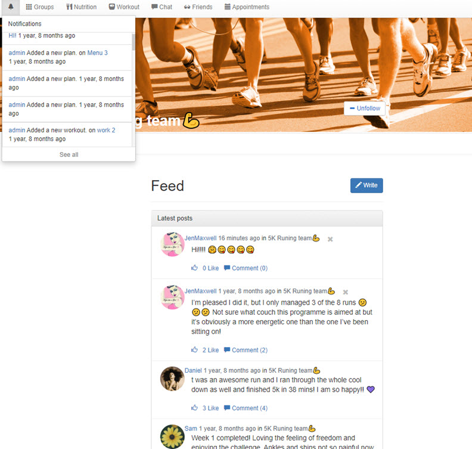
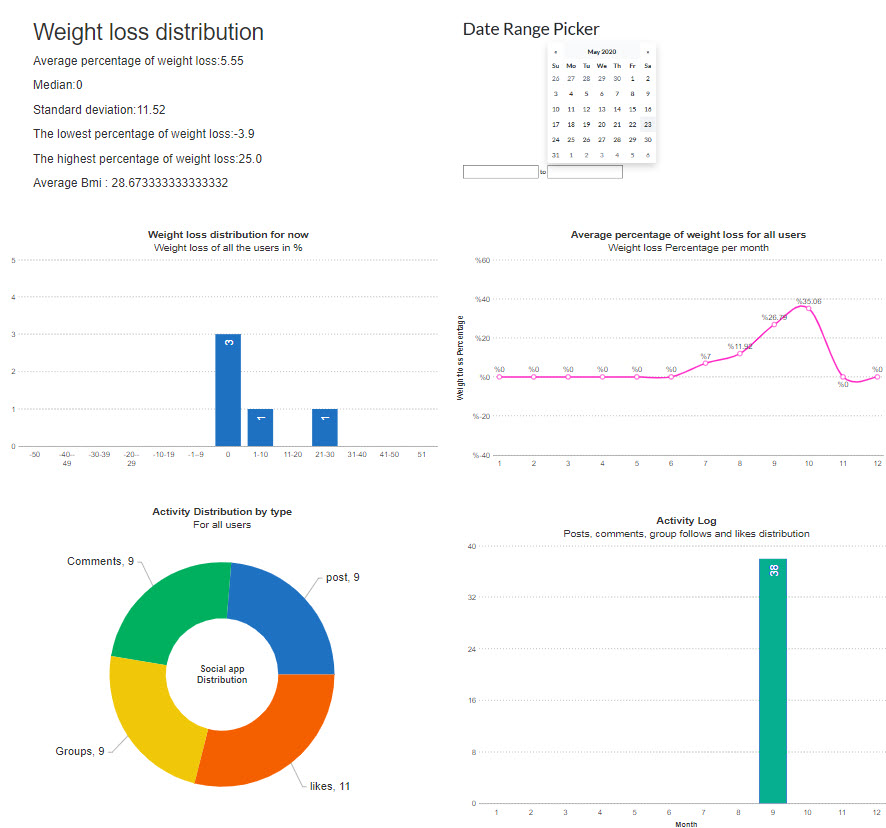
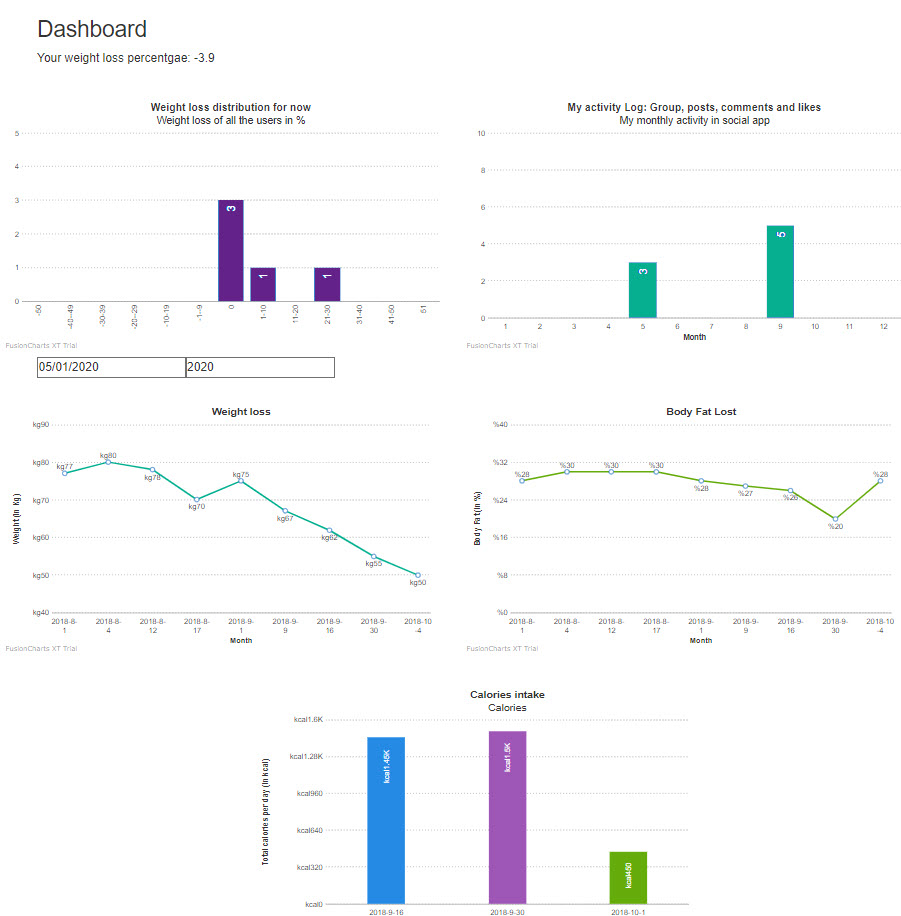
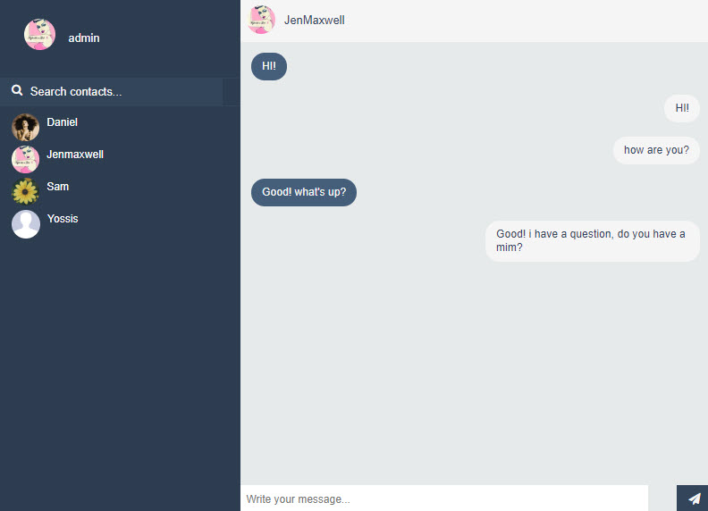

# HealthyHipe

Healthyhipe is a social media for health.
[Short clip](https://drive.google.com/file/d/1pvN7JPLx6ok_mz96d6MOd53x35kvFQUA/view?usp=drive_web).

The project includes the following features:

 * Groups - Users can create, manage and follow groups. Each group includes its own social feed and group members.
 * Real time chat
 * Nutrition menus and workout programs
 * Personal profile - support and monitor patients to better manage their own health
 * Dynamic dashboards
 * Dynamic reports
 * Notifications
 * Admin control panel
  
## Technologies:
 * Python
 * Django Web Framework 
 * SQLite
 * Jquery
 * Redis
 * Bootstrap
 
 
  
 
 
 
